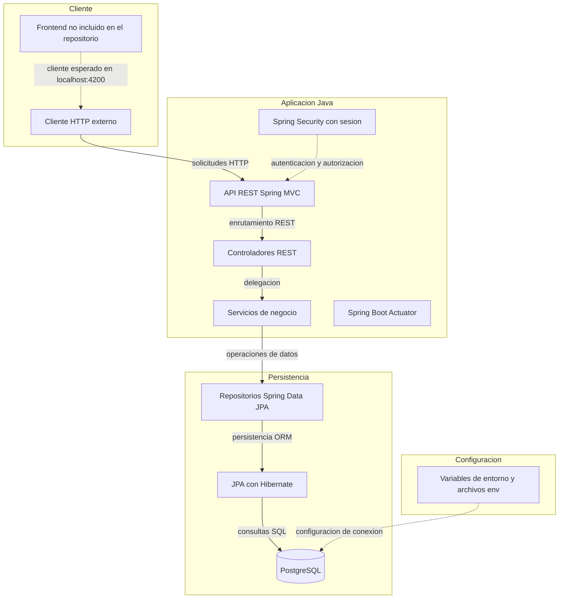
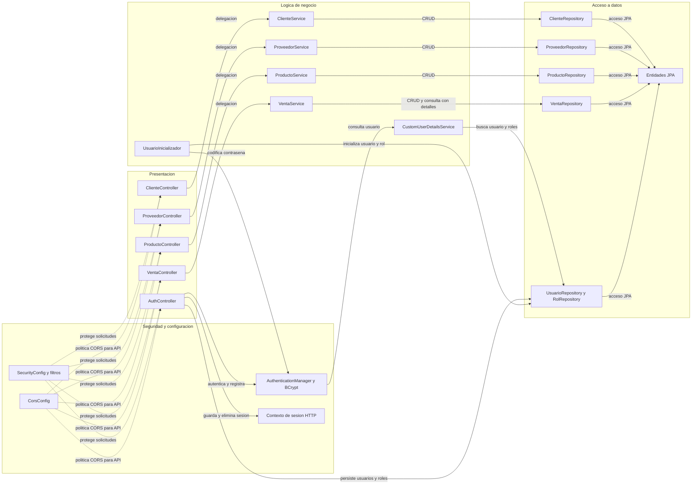

# Architecture Diagram

Este proyecto es un backend Java para la gestión de clientes, proveedores, productos, ventas y usuarios. La aplicación expone una API REST con Spring Boot y persiste sus datos en PostgreSQL.

## Application Architecture

<!-- mermaid-checked: no \n, no em-dash/en-dash, no {} in labels, subgraphs are id["label"], arrows are -->|"label"|, all subgraphs closed by end, ids unique -->

### Technology Stack Summary

| Layer | Technology | Version | Purpose |
|---|---|---|---|
| Lenguaje y runtime | Java | 21 | Ejecucion de la aplicacion |
| Framework | Spring Boot | 4.2.0-SNAPSHOT | Configuracion y ciclo de vida del backend |
| API | Spring MVC | Gestion de versiones por Spring Boot | Exponer endpoints REST |
| Seguridad | Spring Security | Gestion de versiones por Spring Boot | Autenticacion basada en sesion y control de acceso |
| Persistencia | Spring Data JPA y Hibernate | Gestion de versiones por Spring Boot | Acceso ORM a entidades y datos |
| Base de datos | PostgreSQL | No especificada | Persistencia relacional |
| Validacion | Jakarta Bean Validation | Gestion de versiones por Spring Boot | Validacion de entradas |
| Observabilidad | Spring Boot Actuator | Gestion de versiones por Spring Boot | Endpoints de salud y operacion |
| Construccion | Apache Maven | No especificada | Gestion de dependencias y empaquetado |
| Cliente | Cliente HTTP externo | No identificado | Consumir la API; CORS permite `http://localhost:4200` |

### Data Storage & External Services

PostgreSQL es la unica base de datos identificada; Spring Data JPA y Hibernate median el acceso a las tablas de clientes, proveedores, productos, inventario, ventas y usuarios. Las credenciales de conexion y del usuario inicial se obtienen de variables de entorno o archivos `.env`. No se encontraron caches, brokers de mensajes ni integraciones con APIs externas. La configuracion CORS permite un cliente local en el puerto 4200, pero el frontend no forma parte del codigo inspeccionado.

### Key Architectural Decisions

- Organiza el backend en capas de controladores REST, servicios de negocio y repositorios Spring Data JPA.
- Usa entidades JPA y DTOs con validacion para separar el modelo persistido de los contratos de API.
- Configura autenticacion de usuario con Spring Security, contrasenas BCrypt y contexto de seguridad HTTP basado en sesion.

## Component Relationships

<!-- mermaid-checked: no \n, no em-dash/en-dash, no {} in labels, subgraphs are id["label"], arrows are -->|"label"|, all subgraphs closed by end, ids unique -->

### Component Inventory

| Component | Layer | Type | Responsibility |
|---|---|---|---|
| AuthController | Presentacion | REST controller | Registro, inicio y cierre de sesion |
| ClienteController | Presentacion | REST controller | Endpoints de clientes |
| ProveedorController | Presentacion | REST controller | Endpoints de proveedores |
| ProductoController | Presentacion | REST controller | Endpoints de productos |
| VentaController | Presentacion | REST controller | Endpoints de ventas |
| ClienteService | Logica de negocio | Servicio | CRUD de clientes y conversion a DTOs |
| ProveedorService | Logica de negocio | Servicio | CRUD de proveedores |
| ProductoService | Logica de negocio | Servicio | CRUD de productos |
| VentaService | Logica de negocio | Servicio | Gestion de ventas, calculo de totales y detalles |
| CustomUserDetailsService | Logica de negocio | Servicio de seguridad | Carga usuarios y autoridades para Spring Security |
| UsuarioInicializador | Logica de negocio | Inicializador | Crea o actualiza usuario inicial y rol USER al arrancar |
| Repositorios Spring Data JPA | Acceso a datos | Repositorios | Persisten entidades y consultan usuarios, roles y ventas |
| Entidades JPA | Acceso a datos | Modelo de persistencia | Representan clientes, proveedores, productos, inventario, ventas, usuarios y roles |
| SecurityConfig | Seguridad y configuracion | Configuracion | Define autenticacion, permisos, BCrypt y contexto de seguridad |
| CorsConfig | Seguridad y configuracion | Configuracion web | Permite solicitudes CORS de la API desde localhost:4200 |
